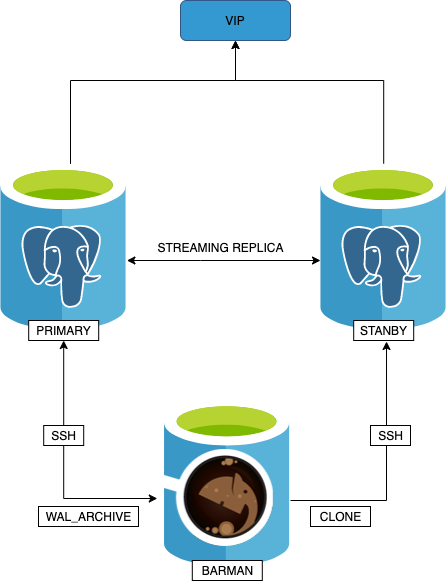
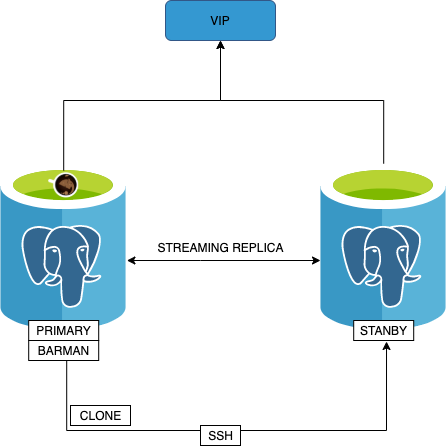
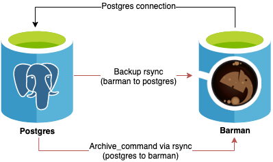

# Postgres Cluster Primary-Standby #

This project aim to provide a simple completly automatic procedure to install a PostgresSQL cluster.

## Getting Started ##

The cluster is organized into 3 different resources. A primary server where the clients  read and write data, a standby server as read-only replica server and finally a server to manage the backup.

This features are covered by the cluster:

* Streaming Replica
* Autofailover
* Backup

## Prerequisites  ##

This playbook presume you have the following resource :
```
1. 3 Dedicated instances master, standby, backup server
2. Bastion host ssh connected to the other instances of the cluster with Ansible 2.7.x / 2.8
3. Add to sshd AllowGroups the user "barman" and "postgres" 
```

**Reference configuration for M5.xlarge instance**

## Architecture ##

### Scenario 1 -- Barman dedicated server



NB: In this scenario rembember to define "dedicated_barman" variable on site yaml

### Scenario 2 -- Barman instance on master 




## Streaming Replica and Autofailover ##

In order to manage the cluster replica and autofailover between primary and replica server, the following tools will be installed with ansible playbooks:
 
```
Repmgr: A open source tool for managing replication and failover from 2ndquadrant. (https://repmgr.org)
Keepalived: A open source tool for managing virutal IP. (https://www.keepalived.org)

```

Repmgr have a configuration file where setup the cluster replication and barman backup server.
The autofailover it's managed by repmgrd, an agent running on primary and standby server.
 
Keepalived provides vip share by primary and standby. When postgresql fail on primary instance, repmgr perform autofailover and set stanby server as new primary. Keepalived check the cluster status and assign the vip to the current primary server.

**This variable --cloud_enviroment-- must be specified to support installation of keepalived on aws cloud tenant, if it's not defined it's installed on on-premises enviroments.**

**On AWS: Keepalived ansible role set a private ip link to an aws interface id. So it must be create a IAM role on EC2 to provide programmatic access to primary ec2  and standy instances. <br/><br/> Obviously we recommend using AWS ELB**

In order to rejoin the initial situation it's necessary to launch the following commands:

1. Stop postgres on primary node and check if standby raise up to primary
```
/usr/pgsql-11/bin/repmgr service status
```
2. Rejoin master as standby node to the cluster
```
/usr/pgsql-11/bin/repmgr -f /etc/repmgr/11/repmgr.conf node rejoin -d "postgres://repmgr@standbyIP:5432/repmgr" --force-rewind
```
3. Reset cluster status as default ( run on master currently standby node)
```
/usr/pgsql-11/bin/repmgr standby switchover -f /etc/repmgr/11/repmgr.conf
```


## Backup ##

References: https://www.pgbarman.org/index.html <br>
There are many tools to take backup of postgres db. We have picked "barman" because it's full compatible with repmgr and it's developed by the same society 2ndquadrant.

There are different ways to implement backup with barman. The following picture describe the current architecture:



In this architecture :
1. A standard connection to PostgreSQL for management, coordination, and monitoring purposes.
2. SSH connection for base backup operations to be used by rsync that allows the barman user on the Barman server to connect as postgres user on the PostgreSQL server.
3. SSH connection for WAL archiving to be used by the archive_command in PostgreSQL and that allows the postgres user on the PostgreSQL server to connect as barman user on the Barman server.
   
Then with repmgr and barman it's possibile to create new replica instance start from a primary backup with one single and simple command. 

```
## On new replica instance stop postgresql 
sudo /etc/init.d/postgresql stop
# Clone the server from primary server
sudo -u postgres repmgr -h primaryIP -U repmgr -d repmgr -p 5432 -F standby clone
# Restart postgreSQL on new replica
sudo /etc/init.d/postgresql restart
# Register the new node as standby
sudo -u postgres repmgr standby -F register
```

***What are the critical issues of this architecture on backup server ?***

1. Connection between primary and barman server. If this connections fail, primary server could be not available ( but autofailover switch automatically to stanby instance)
2. Backup require disk space. So it's important to configure backup on a separate disk mount with a sufficient free space, define a retention on backup data.

All the barman configurations are at this path: /etc/barman.conf

In this file there are configurations about:
 1. Barman server 
 2. The databases instance to backup 

Simple commands with barman:

```
barman check "hostname databse": Check command before take database backup.
barman backup "hostname databse": Execute backup from instance configured on barman configuration file.
barman list-backup "hostname database": List all backups

```
## Restore ##

There are two simple requirements ot perform recovery:

1. Identical hardware architecture
2. Identical major version of PostgreSQL 

```
barman recover --remote-ssh-command "ssh postgres@host" SERVER_NAME BACKUP_ID $PGDATA
```

***Do not issue a recover command using a target data directory where a PostgreSQL instance is running. In that case, remember to stop it before issuing the recovery !*** 

## Monitoring ##

Reference: https://github.com/wrouesnel/postgres_exporter

## Compatibility ##

Minimum OS versions:
CentOS: 7

✅ tested on CentOS 7.5.1804

PostgreSQL versions: 11

## Deployment: quick start ##

1. Install Ansible to the managed machine
2. Download or clone this repository
3. Edit the inventory file. Specify the ip addresses and connection settings for your environment:
    ### [Master/Standby variables]
    * ansible_ssh_host
    * hostname
    * interface_id
    * priority
    * keepalived_state
    * keepalived_unicast_ip
    ### [Common variables]
    * ansible_ssh_private_key_file
    * ansible_user
    * ansible_ssh_extra_args
    * subnet_vpc
    * keepalived_virtual_ip
    * cloud_enviroment (define on cloud site )
    * dedicated_barman (define for barman dedicated server)
  
4. ansible-playbook -i postgres-config.yml postgres-install.yml